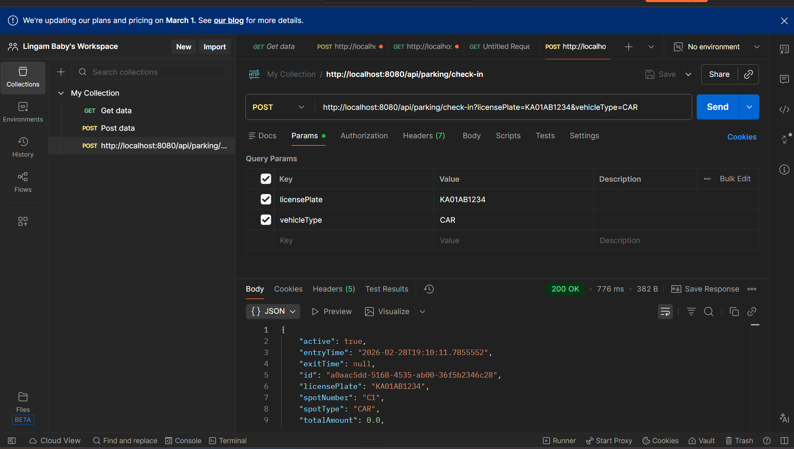
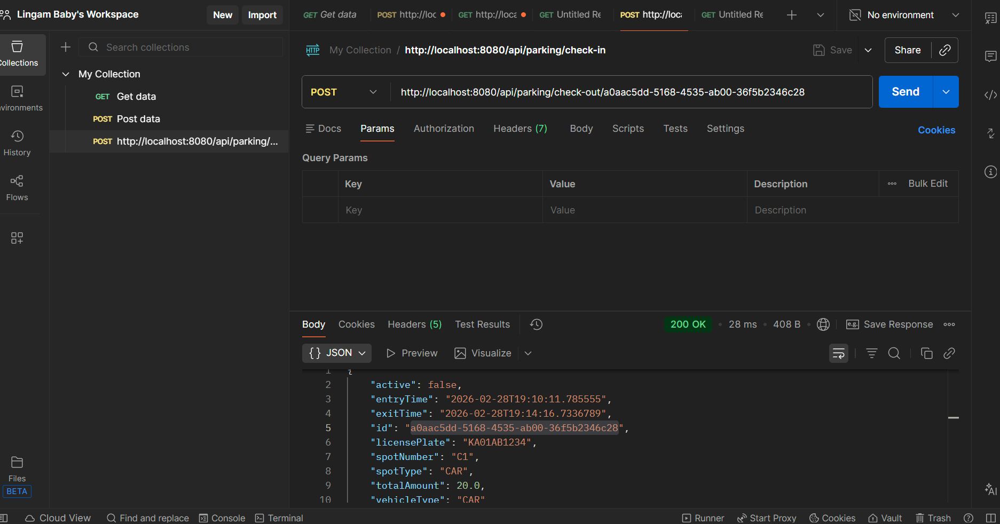

```markdown
# 🚗 Smart Parking Lot Backend System

A Spring Boot application for managing a smart parking lot system using **Spring Data JPA**, **Hibernate**, and **PostgreSQL**.

---

## 🏗 Project Structure

```

com.parking.smart_parking_lot
│
├── model             # JPA entity classes
├── repository        # Spring Data JPA repositories
├── service           # Service layer classes
├── controller        # REST controllers
└── SmartParkingLotApplication.java  # Main Spring Boot application

````

---

## ⚙️ Technologies Used

- **Java 25**
- **Spring Boot 4.0.3**
- **Spring Data JPA**
- **Hibernate 7.2.4**
- **PostgreSQL 18.3**
- **Lombok 1.18.42**
- **Maven**
- **Tomcat 11** embedded server

---

## 📦 Prerequisites

- Java 25 or higher
- PostgreSQL installed and running
- Maven installed

---

## ⚡ Setup Instructions

1. **Clone the repository**

```bash
git clone https://github.com/lingambaby/smart-parking-lot-backend.git
cd smart-parking-lot-backend
````

2. **Configure the database**

Edit `src/main/resources/application.properties`:

```properties
spring.datasource.url=jdbc:postgresql://localhost:5432/parking
spring.datasource.username=postgres
spring.datasource.password=Jha*****

spring.jpa.hibernate.ddl-auto=update
spring.jpa.show-sql=true
```

3. **Run the application**

```bash
mvn spring-boot:run
```

* Application runs at **[http://localhost:8080](http://localhost:8080)**
* Hibernate automatically creates/updates tables based on JPA entities

---

## 🧩 Features

* Automatic parking spot allocation based on vehicle type
* Vehicle check-in and check-out with UUID tickets
* Parking fee calculation:

```text
duration = ceil((exit_time - entry_time) in hours)
fee = duration * hourly_rate
if duration_minutes <= grace_period:
    fee = 0
```

* REST API endpoints
* Real-time spot availability updates
* PostgreSQL database integration

---

## 🔗 API Endpoints

Base URL: `http://localhost:8080/api/parking`

### 1️⃣ Vehicle Check-In

* Method: POST
* URL Example:

```
http://localhost:8080/api/parking/check-in?licensePlate=KA01AB1234&vehicleType=CAR
```

* Query Parameters:

  * `licensePlate` (String)
  * `vehicleType` (Enum: CAR, BIKE, etc.)

**Screenshot:**



---

### 2️⃣ Vehicle Check-Out

* Method: POST
* URL Example:

```
http://localhost:8080/api/parking/check-out/2f7a3c3c-2c7b-4d2f-bb42-6d0d6c0b2a1d
```

* Path Variable:

  * `ticketId` (UUID from check-in)

**Screenshot:**



---

## 🔐 Concurrency Handling

* Spot allocation handled within transactional service layer
* Prevents double allocation during simultaneous check-in/check-out

---

## 👨‍💻 Author

Lingam Baby

```
